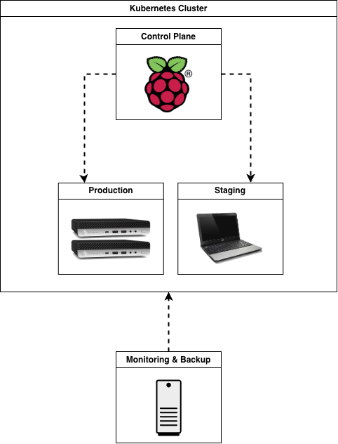

# Kubernetes Homelab

This repository contains my Kubernetes homelab setup, where I document and share my learning journey

## Architecture

## Getting Started

### Prerequisites
Before you begin, make sure you have:
<ol>
<li>Ansible installed on the control machine</li>
<li>SSH access to all target nodes</li>
<li>Inventory file properly configured (masters/workers)</li>
<li>Passwordless sudo on all nodes</li>
</ol>

Internet access from nodes (or a local mirror/registry)

### Execution Order (Important)
⚠️ The playbooks must be executed in the following order to avoid dependency issues.
<ol>
<li>Kubernetes Node Base Setup</li>

* Prepares all nodes with required kernel modules, sysctl settings, and base system packages.

> ansible-playbook -i inventory.ini ansible/k8s-node-setup.yaml

* How/where to download your program
* Any modifications needed to be made to files/folders

<li>Open-iSCSI Installation</li>
Installs Open-iSCSI, which is required for Kubernetes persistent storage and Longhorn.

> ansible-playbook -i inventory.ini ansible/open-iscsi.yaml

<li>NFSv4 Setup</li>
Installs and configures NFSv4 support on all Kubernetes nodes.

> ansible-playbook -i inventory.ini ansible/NFSv4.yaml

<li>Cryptsetup Installation</li>

Installs cryptsetup for encrypted block device support (required by Longhorn).

> ansible-playbook -i inventory.ini ansible/cryptsetup.yaml

<li>Flannel Network Plugin</li>
Deploys the Flannel CNI for pod networking.

> ansible-playbook -i inventory.ini ansible/install_flannel.yaml

* If CNI logic is separated:
> ansible-playbook -i inventory.ini ansible/install_flannel_cni.yaml

<li>Install longhornctl</li>
Installs the Longhorn CLI (longhornctl) on the nodes or control host.

> ansible-playbook -i inventory.ini ansible/install_longhornctl.yaml

<li>Longhorn Preflight Checks</li>

Runs Longhorn preflight validation to ensure all nodes meet the requirements.

> ansible-playbook -i inventory.ini ansible/longhornctl_preflight.yaml
</ol>

## What This Cluster Runs
- NGINX Ingress Controller
- Longhorn for persistent storage
- Grafana + Prometheus

## Failure Scenarios
### Scenario 1: Failure Scenario – Broken Ingress

I intentionally misconfigured the Ingress to point to a non-existing Service.
NGINX returned `503 Service Temporarily Unavailable`, and kubectl describe ingress clearly showed that the backend Service was not found.
This confirmed that Ingress routing, TLS, and the controller itself were working correctly, and the issue was isolated to the Service layer.

---

### Scenario 2: Node Shutdown and Pod Rescheduling

#### Objective
Validate how Kubernetes behaves when a node hosting a StatefulSet pod is abruptly
shut down.

#### Test Steps
1. Identify the node running the StatefulSet pod:
   `kubectl get pod mysql-0 -o wide`

2. Shut down the node without draining it (simulate a real crash):
   `sudo shutdown -h now`

3. Observe node and pod state:

   `kubectl get nodes`

   `kubectl get pod mysql-0 -o wide -w`

#### Observed Behavior
- Node transitions to `NotReady`
- Pod initially remains in Running state
- After the eviction timeout, the pod enters Terminating state
- No new pod is created automatically

#### Explanation
StatefulSets preserve pod identity and prevent duplicate pods with the same ordinal.
Kubernetes waits for the node to recover before rescheduling to avoid data corruption.

#### Key Takeaway
Node shutdown does not immediately trigger pod recreation for StatefulSets.
Manual intervention is required if the node is permanently unavailable.

---

### Scenario 3 Recovery: Manual Pod Rescheduling

#### Objective
Recover a StatefulSet pod when the node is permanently down.

#### Recovery Steps

1. Force delete the stuck pod:

   `kubectl delete pod mysql-0 --grace-period=0 --force`

2. Unattach the disk from Longhorn dashboard

3. Watch the pod get recreated:

   `kubectl get pods -w`

#### Result
- The StatefulSet recreates the pod with the same name
- The pod is scheduled on a healthy node
- Longhorn reattaches the existing volume
- The application starts successfully

#### Key Takeaway
When a node is permanently unavailable, force-deleting the pod allows Kubernetes
and Longhorn to safely reschedule the workload without data loss.

## Future Failure Scenarios Roadmap
- Broken deployment rollout and rollback

## Key Design Decisions
- Why Flannel
- Why Longhorn
- Why Ingress instead of LoadBalancer
The LoadBalancer Service operates at Layer 4 (TCP/UDP), while the Ingress Controller works at Layer 7. By using NGINX Ingress, we can support host-based and path-based routing, as well as TLS termination