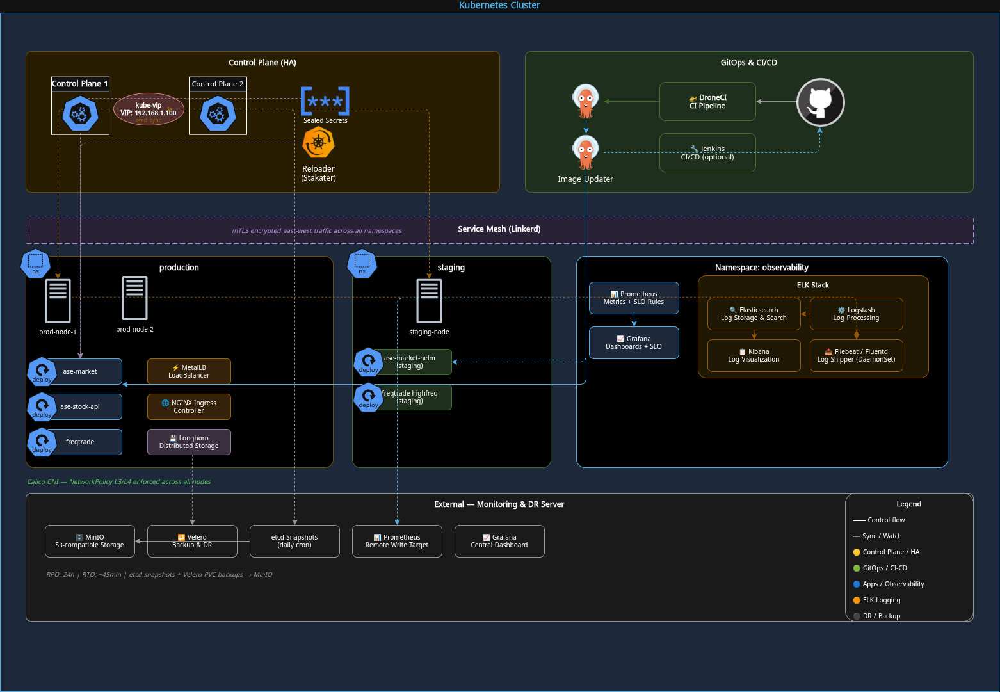

# Kubernetes Homelab

A self-hosted Kubernetes cluster used to document and share my homelab learning
journey — bootstrap, storage, networking, service mesh, observability, and
access control.

For step-by-step operational procedures (bootstrap order, backups, upgrades,
troubleshooting), see [RUNBOOK.md](RUNBOOK.md).

## Architecture

## Cluster Topology

| Node | Role | IP |
|---|---|---|
| Control plane | `masters` | 192.168.0.157 |
| Worker | `workers` | 192.168.0.155 |
| Worker | `workers` | 192.168.0.156 |
| Worker | `workers` | 192.168.0.159 |

Inventory groups (`ansible/hosts.ini`):
- `masters` / `workers` — cluster nodes
- `homelab` — all nodes (masters + workers), used by playbooks that apply cluster-wide
- `new` — staging group for nodes provisioned but not yet joined to the cluster

## Software Stack

| Layer | Component | Notes |
|---|---|---|
| Provisioning | Ansible (`ansible/`) | Node prerequisites, kubeadm bootstrap, day-2 maintenance — see [ansible/README.md](ansible/README.md) |
| Container runtime | containerd | |
| CNI | Calico | Migrated from Flannel |
| CSI / Storage | Longhorn | Requires `cryptsetup`, `open-iscsi`, NFSv4 |
| Ingress | NGINX Ingress Controller | L7 routing + TLS termination |
| Load balancer | MetalLB | `k8s-services/metallb-config.yaml` |
| Service mesh | Istio | Gateway + peer authentication for `ase-market` (`istio/`) |
| Observability | Prometheus, Grafana, Node Exporter | |
| Remote access | Teleport | Kubernetes agent via Helm (`teleport/`) |
| RBAC | Custom roles/bindings | `RBAC/` |

## Workloads

- **ase-market** — sample microservice deployed via Helm (`helm/ase-market/`), fronted by the Istio gateway
- **freqtrade** — algorithmic trading bot deployments (`freqtrade/`)

## Prerequisites

- Ansible installed on the control machine
- SSH access to all target nodes, with passwordless sudo
- Inventory configured at `ansible/hosts.ini` (masters/workers)
- Internet access from nodes (or a local mirror/registry)

## Key Design Decisions

| Decision | Rationale |
|---|---|
| Ingress over per-Service LoadBalancer | LoadBalancer operates at L4 (TCP/UDP); NGINX Ingress operates at L7, enabling host- and path-based routing plus TLS termination from a single entry point |
| Calico (migrated from Flannel) | See `ansible/install_calico.yml` for the migration playbook |
| Longhorn for storage | _TODO: document rationale_ |

## Further Reading

- [RUNBOOK.md](RUNBOOK.md) — bootstrap order, day-2 operations, backups, incident playbooks
- [ansible/README.md](ansible/README.md) — full playbook inventory and configuration layout (`group_vars`, `host_vars`, `ansible.cfg`)
- [RBAC/README.md](RBAC/README.md) — per-user kubeconfig / RBAC setup
